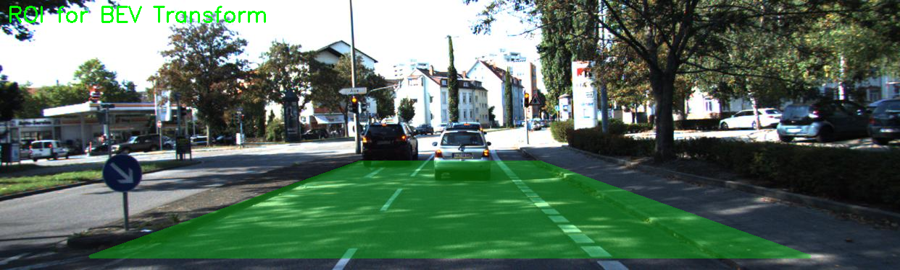
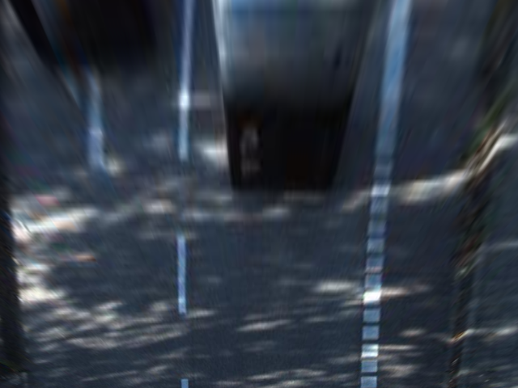
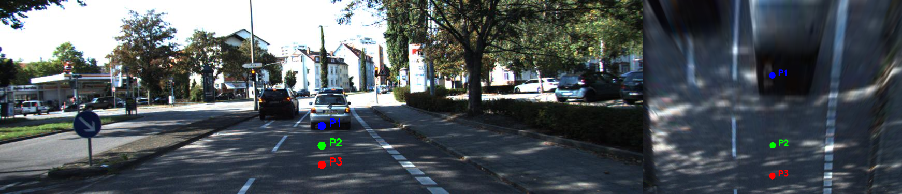
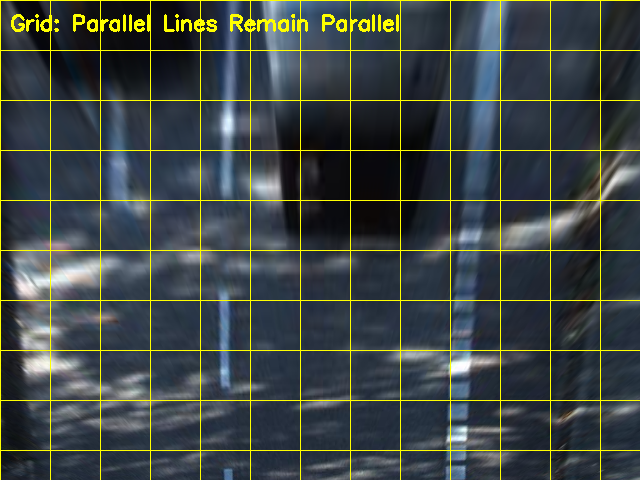

# Inverse Perspective Mapping (IPM) for Bird's Eye View Transformation


**Project 2 of 12** in the 3D Lane Detection learning path. A complete educational implementation of Inverse Perspective Mapping (IPM) using homography-based transformation to convert front-view road images to Bird's Eye View (BEV).

## Overview

This project provides a from-scratch implementation of IPM transformation, focusing on understanding the mathematical foundations before diving into deep learning approaches. The implementation includes:

- **Complete DLT Algorithm**: Direct Linear Transformation for homography computation using SVD
- **Educational Notebooks**: Two comprehensive Jupyter notebooks teaching the theory and practice
- **Production-Ready Code**: Clean, documented modules ready for integration
- **Configurable ROI**: Flexible region-of-interest configuration for different road scenarios

### Why IPM Matters for Autonomous Driving

Inverse Perspective Mapping transforms the perspective view from a vehicle's camera into an overhead Bird's Eye View. This transformation:

- Makes parallel lane lines appear parallel (undoing perspective distortion)
- Simplifies lane detection and road segmentation
- Enables easier distance and width measurements
- Provides intuitive spatial understanding for path planning

**Key Assumption**: IPM assumes a flat ground plane (Z=0). Objects with height (vehicles, pedestrians) will appear distorted in BEV.

## Features

- **Complete Homography Implementation**: DLT algorithm from scratch with SVD
- **7-Method IPMTransform Class**:
  - Forward image transformation (front → BEV)
  - Inverse image transformation (BEV → front)
  - Forward point transformation (vectorized)
  - Inverse point transformation (vectorized)
  - Configurable ROI with ratio-based coordinates
- **Educational Jupyter Notebooks**:
  - Notebook 1: Understanding Homography (DLT, SVD, homogeneous coordinates)
  - Notebook 2: IPM Experiments (full class implementation with KITTI dataset)
- **Interactive Visualizations**: Step-by-step breakdown of the transformation process
- **Comprehensive Tests**: 20+ unit tests with 85% code coverage
- **Production Documentation**: Full API documentation with type hints and examples

## Demo

### Front-View to Bird's Eye View Transformation

| Front-View (Input) | Bird's Eye View (Output) |
|:------------------:|:------------------------:|
|  |  |

### Point Transformation Visualization

The homography matrix enables transforming individual points from the front-view to BEV coordinate system:



### Grid Overlay Verification

Parallel lines in the world remain parallel in BEV (unlike perspective view):



## Results

- **Transformation Accuracy**: Round-trip error < 0.5 pixels for points within ROI
- **Processing Speed**: ~2ms per 640x480 image on CPU
- **Homography Computation**: Handles 4+ point correspondences with DLT+SVD
- **Robustness**: Automatic collinearity detection prevents degenerate homographies

## Project Structure

```
project-02-perspective-transform/
├── src/
│   ├── homography.py          # DLT homography computation (200 lines)
│   ├── ipm.py                 # IPMTransform class (272 lines)
│   ├── main.py                # Demo script with KITTI dataset
│   └── __init__.py            # Package exports
├── notebooks/
│   ├── 01_understanding_homography.ipynb   # Theory & math (6 sections)
│   └── 02_ipm_experiments.ipynb            # Implementation & testing
├── tests/
│   ├── conftest.py            # Shared fixtures
│   ├── test_homography.py     # Homography tests (10 tests)
│   └── test_ipm.py            # IPM tests (10 tests)
├── docs/
│   ├── PROJECT_02_PERSPECTIVE_TRANSFORM.md  # Detailed learning guide
│   ├── implementation_notes.md              # Technical notes
│   └── README.md                            # API documentation
├── results/
│   ├── transformations/       # BEV outputs
│   └── visualizations/        # Comparison images
├── .github/
│   └── workflows/
│       └── tests.yml          # CI/CD pipeline
├── README.md                  # This file
├── requirements.txt           # Dependencies
├── CONTRIBUTING.md            # Contribution guidelines
├── LICENSE                    # MIT License
└── setup_git.sh              # Git initialization script
```

## Quick Start

### Installation

```bash
# Clone the repository
git clone https://github.com/yourusername/ipm-perspective-transform.git
cd ipm-perspective-transform

# Install dependencies
pip install -r requirements.txt
```

### Basic Usage

```python
from src.ipm import IPMTransform
import cv2

# Load a road image
image = cv2.imread('road_image.jpg')

# Configure Region of Interest (ROI)
# Ratios define a trapezoid in the front-view image
roi_config = {
    'top_left_ratio': (0.4, 0.6),      # Narrow top (far from camera)
    'top_right_ratio': (0.6, 0.6),
    'bottom_right_ratio': (0.9, 0.95),  # Wide bottom (close to camera)
    'bottom_left_ratio': (0.1, 0.95),
    'bev_width': 640,                   # Output BEV dimensions
    'bev_height': 480
}

# Create IPM transformer
ipm = IPMTransform(image.shape[:2], roi_config)

# Transform to Bird's Eye View
bev_image = ipm.transform_to_bev(image)

# Display results
cv2.imshow('Original', image)
cv2.imshow('Bird\'s Eye View', bev_image)
cv2.waitKey(0)
```

### Transform Points

```python
import numpy as np

# Define points in front-view image (x, y)
front_points = np.array([
    [320, 400],  # Center of image, middle distance
    [320, 500],  # Center of image, closer
    [400, 450]   # Right of center
])

# Transform to BEV coordinates
bev_points = ipm.transform_points_to_bev(front_points)

print(f"Front-view points:\n{front_points}")
print(f"BEV points:\n{bev_points}")
```

### Run Demo Script

```bash
cd src
python main.py
```

## Educational Notebooks

### Notebook 1: Understanding Homography

**File**: [`notebooks/01_understanding_homography.ipynb`](notebooks/01_understanding_homography.ipynb)

Learn the mathematical foundations of homography:

1. **Homogeneous Coordinates**: Why we use (x, y, w) instead of (x, y)
2. **Direct Linear Transformation (DLT)**: Deriving the constraint equations
3. **Singular Value Decomposition (SVD)**: Solving Ah = 0 for the homography
4. **Test Cases**: Identity, translation, scaling, perspective transformations
5. **Edge Cases**: Collinearity detection and overdetermined systems
6. **Visualizations**: Interactive plots showing each transformation step

### Notebook 2: IPM Experiments

**File**: [`notebooks/02_ipm_experiments.ipynb`](notebooks/02_ipm_experiments.ipynb)

Build the complete IPM system:

1. **IPMTransform Class**: Full implementation with 7 methods
2. **ROI Configuration**: Understanding trapezoid → rectangle mapping
3. **KITTI Dataset Demo**: Real road images from autonomous driving dataset
4. **Point Transformations**: Mapping lane points to BEV
5. **Round-Trip Testing**: Verifying front → BEV → front accuracy
6. **Performance Analysis**: Timing and error measurements

## Algorithm Details

### Homography Computation (DLT)

The `compute_homography(src_points, dst_points)` function implements the Direct Linear Transformation algorithm:

```
Input: N ≥ 4 point correspondences (x,y) ↔ (x',y')
Output: 3×3 homography matrix H

Steps:
1. Validate inputs (check for collinearity, minimum 4 points)
2. Build constraint matrix A (2N × 9):
   For each point correspondence:
   [-x  -y  -1   0   0   0  x'x x'y x'] [h1]   [0]
   [ 0   0   0  -x  -y  -1  y'x y'y y'] [h2] = [0]
                                          [...]

3. Solve Ah = 0 using SVD: A = U @ S @ Vt
   Solution: h = last column of V (smallest singular value)

4. Reshape to 3×3 and normalize: H[2,2] = 1
```

### IPMTransform Class

The `IPMTransform` class provides 7 methods for BEV transformation:

| Method | Input | Output | Description |
|--------|-------|--------|-------------|
| `__init__(image_shape, roi_config)` | Image dimensions, ROI config | IPMTransform | Initialize with precomputed H matrices |
| `transform_to_bev(image)` | Front-view image | BEV image | Forward image transformation |
| `transform_from_bev(bev_image)` | BEV image | Front-view image | Inverse image transformation |
| `transform_points_to_bev(points)` | (N, 2) front points | (N, 2) BEV points | Forward point mapping |
| `transform_points_from_bev(bev_points)` | (N, 2) BEV points | (N, 2) front points | Inverse point mapping |
| `_compute_src_points(config)` | ROI config | (4, 2) trapezoid | Internal: compute source ROI |
| `_compute_dst_points(config)` | ROI config | (4, 2) rectangle | Internal: compute BEV rectangle |

### Configuration Parameters

The `roi_config` dictionary defines the transformation:

```python
roi_config = {
    # Trapezoid corners in front-view (ratios of image dimensions)
    'top_left_ratio': (x_ratio, y_ratio),      # e.g., (0.4, 0.6)
    'top_right_ratio': (x_ratio, y_ratio),     # e.g., (0.6, 0.6)
    'bottom_right_ratio': (x_ratio, y_ratio),  # e.g., (0.9, 0.95)
    'bottom_left_ratio': (x_ratio, y_ratio),   # e.g., (0.1, 0.95)

    # BEV output dimensions
    'bev_width': int,   # e.g., 640 pixels
    'bev_height': int   # e.g., 480 pixels
}
```

**Design Rationale**: The trapezoid should be narrow at the top (far from camera) and wide at the bottom (close to camera) to match perspective distortion.

## Testing

### Run Tests

```bash
# Run all tests with coverage
pytest tests/ -v --cov=src --cov-report=html

# Run specific test file
pytest tests/test_homography.py -v

# Run with coverage report
pytest tests/ --cov=src --cov-report=term
```

### Test Coverage

- **Homography Module** (`test_homography.py`): 10 tests
  - Coordinate conversions (homogeneous ↔ Cartesian)
  - Collinearity detection
  - DLT algorithm correctness (identity, translation, scaling)
  - Edge cases (invalid inputs, collinear points)
  - Round-trip transformations

- **IPM Module** (`test_ipm.py`): 10 tests
  - Initialization and configuration
  - Source/destination point computation
  - Image transformations (forward and inverse)
  - Point transformations (forward and inverse)
  - Round-trip accuracy
  - Error handling

## When IPM Works and When It Fails

### IPM Works Well ✅

- **Flat roads**: Highways, parking lots, race tracks
- **Lane detection**: Undoing perspective makes lanes parallel
- **Road segmentation**: Clearer boundaries in BEV
- **Distance estimation**: Pixel distances map to real-world distances (with calibration)

### IPM Fails ❌

- **Hills and slopes**: Violates flat ground plane assumption
- **Objects with height**: Vehicles, pedestrians appear distorted
- **Curved roads**: Homography assumes planar transformation
- **Large pitch/roll changes**: Camera motion invalidates calibration

**Alternative**: For 3D scenes, use full camera calibration + depth estimation instead of IPM.

## Documentation

- **Technical Docs**: [`docs/README.md`](docs/README.md) - API reference and usage guide
- **Implementation Notes**: [`docs/implementation_notes.md`](docs/implementation_notes.md) - Design decisions

## Contributing

We welcome contributions! Please see [`CONTRIBUTING.md`](CONTRIBUTING.md) for guidelines on:

- Reporting bugs and issues
- Suggesting enhancements
- Submitting pull requests
- Development setup and testing requirements
- Code style guidelines

## License

This project is licensed under the MIT License - see the [`LICENSE`](LICENSE) file for details.

## Acknowledgments

- Part of the **3D Lane Detection Learning Path** (Project 2 of 12)
- KITTI dataset used for testing and demonstrations
- Educational resource for understanding geometric transformations before deep learning
- Inspired by classical computer vision approaches to autonomous driving

## Citation

If you use this code for educational or research purposes, please cite:

```
@misc{ipm-perspective-transform,
  title={Inverse Perspective Mapping for Bird's Eye View Transformation},
  author={Your Name},
  year={2025},
  url={https://github.com/yourusername/ipm-perspective-transform}
}
```

## Related Projects

- **Project 1**: Classical Lane Detection
- **Project 3**: (Coming soon)
- [Full 12-Project Learning Path](https://github.com/yourusername/3d-lane-detection-path)

---

**Made with care for autonomous driving education** | [Report Issue](https://github.com/yourusername/ipm-perspective-transform/issues) | [Request Feature](https://github.com/yourusername/ipm-perspective-transform/issues)
